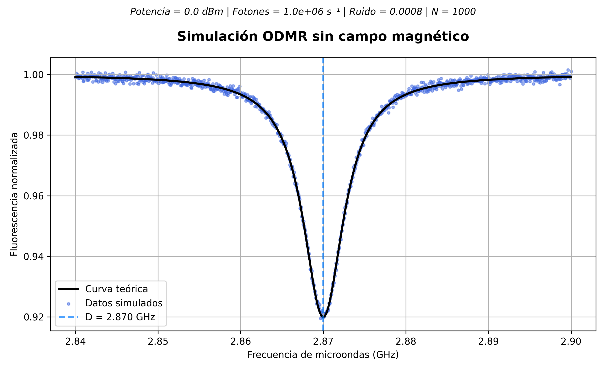

# 🔬 Quantum Sensing

Educational notes and Python simulations on nitrogen-vacancy (NV) centers in diamond.


---

## 📖 Study Manual

This repository includes a complete introductory manual on quantum sensing based on NV centers in diamond, written during my research internship at the Nanomaterials and Nanotechnology Research Center (CINN).

The manual covers the physical principles of NV centers, ODMR, microwave instrumentation, radiofrequency generators and spectrum analyzers, serving as a practical introduction to NV-based quantum sensing.

---

## Overview

This repository contains my study notes, technical documentation and educational material related to quantum sensing with nitrogen-vacancy (NV) centers in diamond.

The project was developed during my summer research internship at the Nanomaterials and Nanotechnology Research Center (CINN), where I am studying the fundamentals of quantum sensing, microwave instrumentation and ODMR (Optically Detected Magnetic Resonance).

Besides theoretical material, the repository includes an interactiva Python program tha simulates ODMR spectra under different experimental conditions and reconstructs the external magnetic field from the resonance frequencies.

---

## Repository Contents

- 📃 Literature review
- 📃 Study notes
- 📃 Technical summaries
- 📊 Figures and diagrams
- 🐍 Interactive ODMR simulator (Python)
- 📑 Automatically generated simulation reports

---

## 🐍 ODMR Simulator

The repository includes an interactive Python simulator that reproduces the ODMR spectrum of a single NV center in diamond under different experimental conditions.

The simulator allows the user to modify the main experimental parameters, visualize the resulting ODMR spectra and estimate the external magnetic field from the measured resonance frequencies.

---

### Features

 - ✅ ODMR Simulation without magnetic field
 - ✅ ODMR Simulation with external magnetic field
 - ✅ Zeeman splitting simulation
 - ✅ Adjustable microwave power
 - ✅ Adjustable photon detection rate
 - ✅ Adjustable experimental noise
 - ✅ Automatic resonance detection
 - ✅ Magnetic field estimation
 - ✅ Relative sensitivity calculation
 - ✅ Comparison of multiple magnetic fields
 - ✅ Automatic PNG figure generation
 - ✅ Automatic TXT report generation

---

## Example Outputs
### ODMR Spectrum without magnetic field


---

### ODMR Spectrum with external magnetic field


---

### Comparison of different magnetic fields


---

## 📈 Research Progress

Current status of the project:

- ✅ Literature review on quantum sensing
- ✅ Study of nitrogen-vacancy (NV) centers in diamond
- ✅ ODMR theoretical foundations
- ✅ Educational notes and technical summaries
- ✅ Python ODMR simulator (Version 1.0)
- ✅ Automatic report generation
- ✅ Figure generation for data visualization
- 🔄 Continuous improvement of documentation and educational material

---

## ✡️ Physics Implemented

The simulator includes the following physical concepts:

- Zero-field splitting (D = 2.87 GHz)
- Zeeman interaction under an external magnetic field
- Lorentzian ODMR resonance model
- Gaussian experimental noise
- Automatic resonance detection
- Magnetic field reconstruction from resonance frequencies

---

## 💻 Requirements

The simulator was developed in Python and requires:

- Python 3.11 or later
- NumPy
- Matplotlib
- SciPy

---

## 📚 References

This project is based on scientific literature and educational resources on quantum sensing and nitrogen-vacancy (NV) centers in diamond, including review articles, textbooks and technical documentation used during the research internship at CINN.

Key references include:

- Degen, C. L., Reinhard, F., & Cappellaro, P. (2017). Quantum Sensing.
- Rondin, L. et al. (2014). Magnetometry with nitrogen-vacancy defects in diamond.
- Barry, J. F. et al. (2020). Sensitivity optimization for NV-based quantum sensors.
- Additional scientific articles and technical documentation are listed in the accompanying study manual.

---

## ▶️ How to Run

Clone the repository:

```bash
git clone https://github.com/sofianunezda/Quantum-sensing.git
```

Install the required packages:

```bash
pip install numpy matplotlib scipy
```

Run the simulator:

```bash
python odmr_simulation.py
```

---

## 🎯Project Goals 

The aim of this repository is to provide an accessible introduction to quantum sensing based on nitrogen-vacancy (NV) centers in diamond by combining theoretical background with interactive numerical simulations.

The project is intended for physics students, researchers beginning in the field and anyone interested in understanding the fundamental principles of NV-based quantum sensing.

---

## 📄 License

This project is intended for educational and research purposes.

The source code and documentation are available for academic use. Please cite or acknowledge this repository if you use its material in your own work.

---

## 👩‍🔬 Author

**Sofía Núñez de Andrés**

Physics Student
University of Oviedo

Research internship at the Nanomaterials and Nanotechnology Research Center (CINN)

GitHub:
https://github.com/sofianunezda

---

